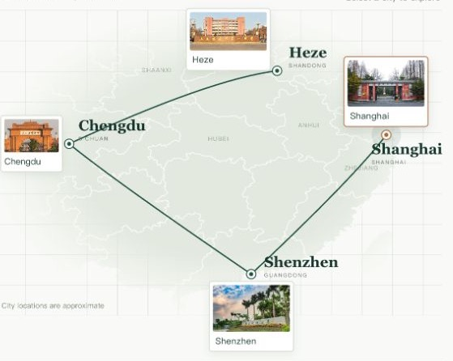

# Hi, I'm Chengzhi Zhao 👋

**Ph.D. Student at Fudan University · AI for Biology**

I work at the intersection of artificial intelligence and biomedicine, in the Department of Medical Systems Biology, School of Basic Medical Sciences, Fudan University.

## My academic journey

  

- **Heze** — Heze No. 1 High School
- **Chengdu** — Southwest Jiaotong University · Undergraduate
- **Shenzhen** — Southern University of Science and Technology · Graduate studies in Bioinformatics
- **Shanghai** — Fudan University · Ph.D. student

## Research interests

- **Single-cell & spatial omics** — large-scale developmental atlas modeling
- **Cell states & fate transitions** — perturbation prediction and generative modeling
- **Biological foundation models** — single-cell foundation models and AI for Biology methods

Previously involved in joint training and research associated with **Microsoft Research Asia**.

📍 Shanghai, China · Fudan University

Map and photo credits

Map geometry: Alibaba Cloud DataV GeoAtlas. Campus photographs: [Heze No. 1 High School](https://www.hzyzh.com.cn/index.php/xinkegai), [Southwest Jiaotong University News](https://news.swjtu.edu.cn/info/1140/44255.htm), [SUSTech College of Science](https://science.sustech.edu.cn/portal/article/index/id/156), and [Fudan University News](https://news.fudan.edu.cn/2023/0128/c45a133795/page.htm). Rights remain with the respective owners. The Chengdu photo depicts the Xipu campus gate bearing the inscription “唐山路礦學堂”.

